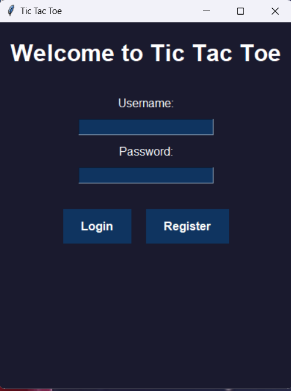
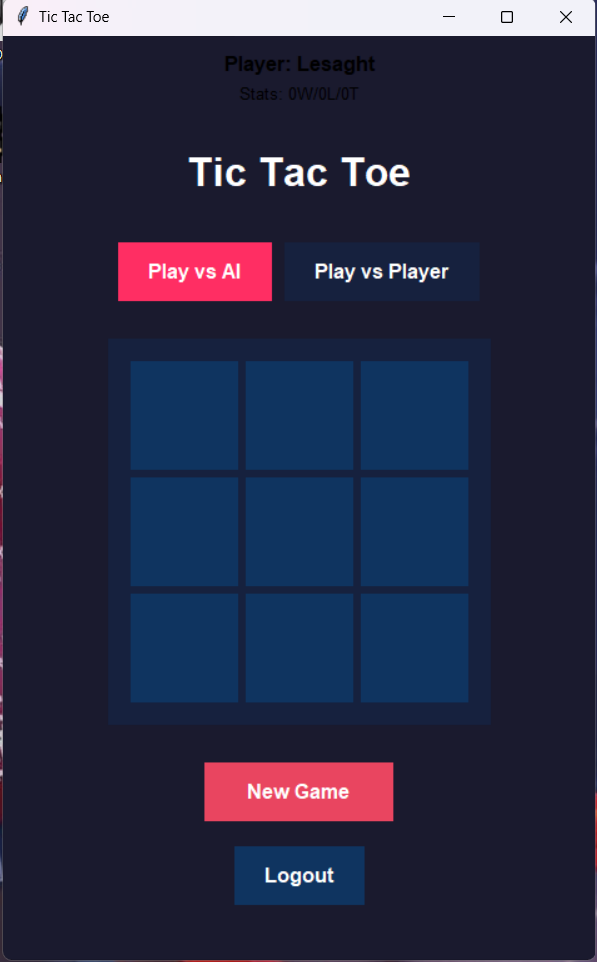

## Tic-Tac-Toe with and without a Bot

This repository contains a Python implementation of the classic Tic-Tac-Toe game, featuring both player-versus-player and player-versus-AI modes. The AI opponent utilizes a minimax algorithm to make optimal moves.

## Features:

• Player vs. Player: Enjoy a traditional game against another player.
• Player vs. AI: Challenge the unbeatable AI opponent.
• User Accounts: Create an account to save your game statistics (wins, losses, ties).

## Screenshots:

Installation:

1. Clone the repository: git clone https://github.com/Lesaght/Tic-Tac-toe-with-and-without-a-bot.git
2. Navigate to the project directory: cd Tic-Tac-toe-with-and-without-a-bot
3. Run the main script: python main.py

## Built With

• Python 3.x
• PyQt5 - For the graphical user interface

## Contributing

Contributions are welcome! Please feel free to open issues or submit pull requests.

Start

Start start.bat

and

run file main.py (python main.py)
